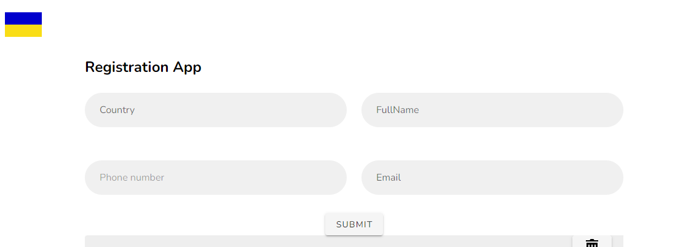

## Application for Users' Registration

## License

The Laravel framework is open-sourced software licensed under the [MIT license](https://opensource.org/licenses/MIT).

Registration page:

The registration page should have an autocomplete of the list of countries (countries.json). When displaying the list, show the name of the country and its flag. After selecting the country we need to prefix the phone code and format the phone field (+972 53 111-22-33).
After submitting the form you need to register the user and in this case in the table users should be only email and name and the rest should be in 2 related tables user_countries and phone_book. After registration you should send sms and email with congratulations about registration.

I need to take a pure Laravel project and implement the form on Vue2 + Vuetify.

## Project Setup Guide
This guide will walk you through the steps to clone, deploy, and run a Laravel project, including installing dependencies, migrating the database, and running the development server.

## _Clone the Repository_

`git clone <repository-url>`
`cd <project-directory>`

## _Install Composer Dependencies_ and _Install NPM Dependencies_
`composer install `
`npm install`

## _Create a Copy of Your .env File_
`cp .env.example .env`
## _Generate Application Key_
`php artisan key:generate
`
## _Run Database Migrations_
`php artisan migrate
`
## _Start the Development Server_
`php artisan serve
`
## _Run NPM Watch (Optional)_
`npm run watch
`
